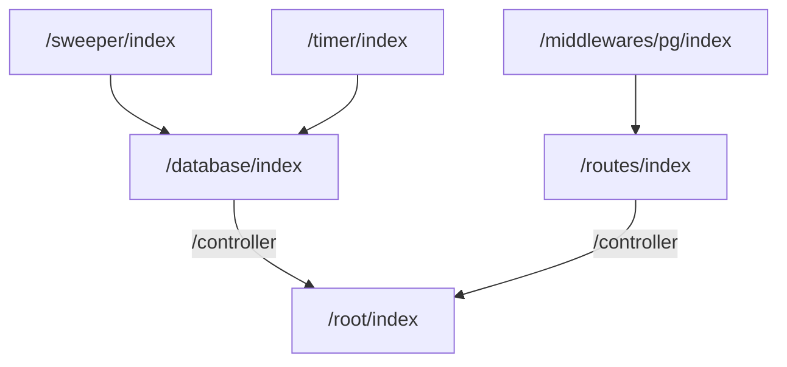

# Modularized Express
Modularized Express is my attempt at making a Node + Express application with modularization.

So far, I made descriptive folder names but a generic "index.js" for every js file in the program. I planned to have every "functional component" stored in its own folder with an "index.*" entry point. Then, in the future, I'll cut up parts of the entry points as they grow bigger but as specific functions with descriptive filenames that explain what they do.

## Structure
The structure for this code base follows a simple branching pattern in which each folder level represents an implementation of decreasing complexity.

## Future Plans
- Integration with SvelteKit.
- Typescript integration.
- POST method.
- PUT method.
- DELETE method.
- Include status codes for routes.